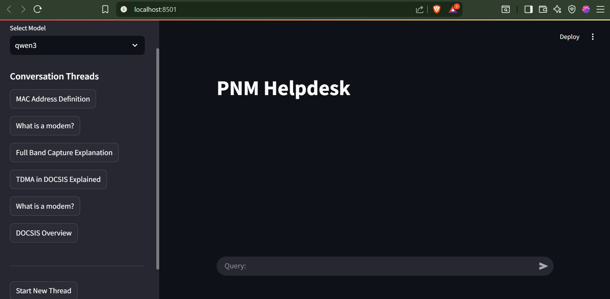

# 🧠 Neuradesk – AI Helpdesk System

Neuradesk is an AI-powered helpdesk platform designed to assist users by providing quick, intelligent, and context-aware responses.  
Built with **Python**, **Streamlit** for the frontend, and an AI backend, it was originally developed during my internship project for a PNM system.  
Due to NDA restrictions, the internal business logic and proprietary integrations are not included — this repository contains a generic, NDA-safe version for demonstration purposes.

---

## 🚀 Features
- AI-driven question answering
- Interactive **Streamlit** web interface
- Multi-session conversation handling
- Support for contextual follow-ups
- Modular design for easy integration with different backends

---

## 🛠️ Tech Stack
- **Python** – Core programming language
- **Streamlit** – Interactive web UI
- **FastAPI** – Backend API (in original NDA version)
- **PostgreSQL / Redis** – Memory and session persistence
- **Hugging Face Transformers** – AI models
- **LangChain / LangGraph** – Conversational flow management

---

## 📦 Installation

### 1️⃣ Clone the Repository
```bash
git clone https://github.com/<your-username>/neuradesk.git
cd neuradesk
2️⃣ Create a Virtual Environment (optional but recommended)
(bash)
Copy
Edit
python -m venv venv
source venv/bin/activate  # On Windows: venv\Scripts\activate
3️⃣ Install Dependencies

(bash)
Copy
Edit
pip install -r requirements.txt
🔑 Environment Variables
Create a .env file in the project root and add:

(ini)
Copy
Edit
API_KEY=your_api_key_here
DB_URL=your_database_url_here
(You can refer to .env.example for guidance)

▶️ Running the Application
(bash)
Copy
Edit
streamlit run app.py
(Replace streamlit_app.py with your main Streamlit file name if different)

📸 Screenshot


📄 License
This repository is shared for educational purposes and does not contain proprietary code covered under NDA.
